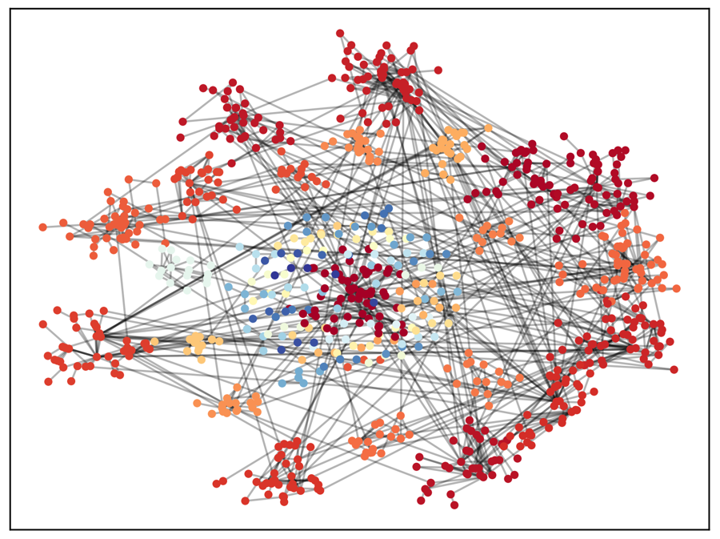
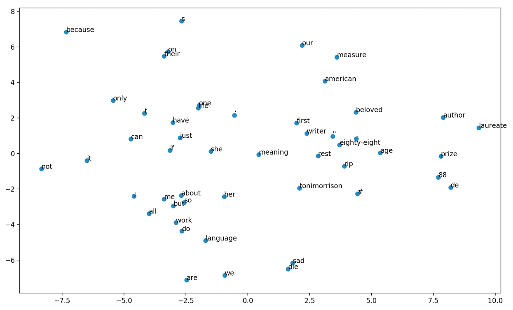

### Analysis of Twitter data

The data are the tweets about an American novelist. The data was collected immediately after her passing.

The .txt file shows a sample of the collected tweets. The attribute 'entities' 'user_mentions' includes all the mentioned users in this tweet.

## Warning

Don't construct a graph with more than 20000 tweets at one time. This amount of data may exceed the capability of the RAM.

## DONE

1. draw the network graph and label different clusters (communities) with different colors. The communities are found through a modularity-based greedy algorithm.

2. embed the words and plot them w.r.t. their PCs.

### results

Isolated islands are not shown.

